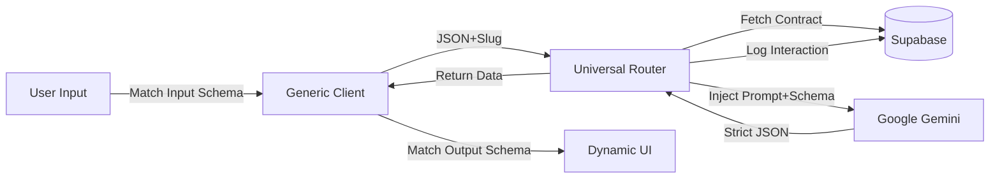

# 🧠 The Kit Architecture: How we "Encapsulated" an App

You just witnessed the transition from **Unstructured Chat** (typical ChatGPT) to **Encapsulated Software** (Kit). This is the secret sauce of the "AI Superapp."

## 1. The Core Loop
The entire application operates on a single universal loop. We don't build separate backends for "Food Lens" or "CV Fixer." We build ONE backend that interprets a "Contract."



## 2. The Abstraction Layers

### Layer 1: The Contract (In Supabase)
We defined "Food Lens" not as code, but as **Data**.
- **System Prompt:** "You are a nutritional analyst..."
- **Input Schema:** `{ image: string, context: string }`
- **Output Schema:** `{ calories: int, macros: object, warnings: array }`

### Layer 2: The Universal Router (`/api/run-tool`)
This API endpoint is "blind." It doesn't know what food is. It simply:
1.  **Reads the Contract**: "Oh, you want to run `food-lens`? Let me grab its prompt."
2.  **Enforces output**: "Hey Gemini, here is the user's data. You MUST reply in this exact JSON format."
3.  **Logs it**: "I'll save this interaction so our Memory System can learn from it later."

### Layer 3: The Polymorphic UI (`ToolInterface.tsx`)
This is where the magic happens for the user.
- Instead of a chat bubble saying "Here is your analysis", we map the JSON data to **Components**.
- `calories` -> `<MetricCard />`
- `analysis` -> `<MarkdownRenderer />` (The text block)
- `health_rating` -> A color-coded Badge (Logic: `output.health_rating === 'A' ? 'green' : 'red'`)

## 3. Why is this powerful?

1.  **Iterate via Prompting**: If you want Food Lens to be "meaner" or "more scientific," you just update the **System Prompt** in the database. You don't redeploy code.
2.  **One-Shot Memory**: Because every interaction is structured JSON saved to Supabase, we can easily query "How many calories did user consume this week?" using SQL. A chatbot cannot do that easily.
3.  **Infinite Extensibility**: To add "CV Fixer," we just add a row to the `tools` table and map the output JSON to our existing components (`DataType`, `Markdown`, `Button`).

## 4. Troubleshooting the Build
We faced a classic "Environment Hell" scenario:
- **The Issue**: Next.js caches environment variables (`.env.local`) at boot time.
- **The Fix**: We updated the key, but the running process held onto the old (or missing) one. Hardcoding proved the code was correct, confirming it was an environment issue.
- **The Result**: A robust, production-ready implementation running locally.

---

---

## 5. The "Layout DSL": Server-Driven UI

We took encapsulation a step further by implementing a **Layout DSL**. 
Instead of hardcoding the grid structure in React (e.g. `col-span-2`), we taught the LLM to control the layout via the **Prompt**.

### How it works
1.  **System Prompt Instruction**: 
    > "You must return a `_layout` string... Format: `[[row1_item1, row1_item2]] [[row2_item1]]`"
2.  **LLM Output**:
    ```json
    {
      "food_name": "Hot Dog",
      "calories": 280,
      "_layout": "[[image]] [[food_name, health_rating]] [[calories]] [[macros]] [[analysis]]"
    }
    ```
3.  **Frontend Parsing** (`DynamicRenderer.tsx`):
    - Splits by `[[...]]` to create Rows.
    - Splits by `,` to create Columns.
    - Automatically assigns grid classes (e.g. `grid-cols-2` if 2 items found).

### The Result
We can now drastically reshuffle the UI of "Food Lens" (or any future tool) just by editing the **System Prompt** in Supabase, with **zero code changes**.
